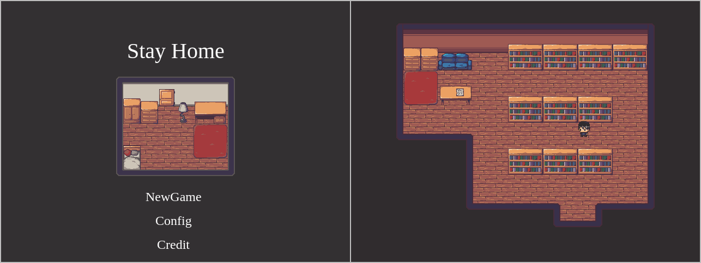

# SimpleEscapeGame

html5ゲームフレームワークのPhaser3を使ったシンプルな脱出ゲーム

- プレイ人数 : 1人
- プレイ時間 : 5-20分

#### 操作方法

|   キー    |  説明                             |
| -------- | --------------------------------- |
|  方向キー |  キャラクターの移動、選択カーソルの移動  |
|  Space   |  調べる、選択決定                    |
|  Shift   |  メニューを開く、キャンセル            |

# ビルド

see the [BUILD.md](./BUILD.md) file

# 実行

see the [BUILD.md](./BUILD.md) file

# ライセンス

see the [LICENSE.md](./LICENSE.md) file